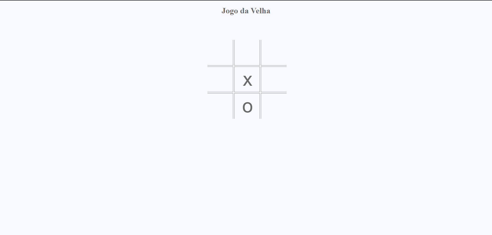
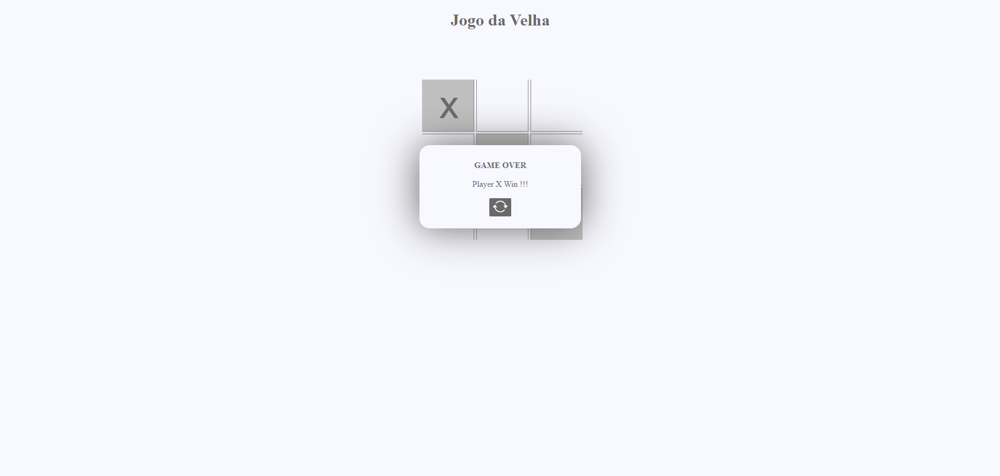

# Dia #6

### Jogo da Velha
Nesse projeto eu desenvolvi um Jogo da Velha com funcionalidade clicando em cada quadrado os jogadores cada um tem uma jogada por vez, tecnologias utilizadas HTML, CSS, JavaScript. 

# screenshots do projeto

Aqui tem umas screenshots do projeto:

